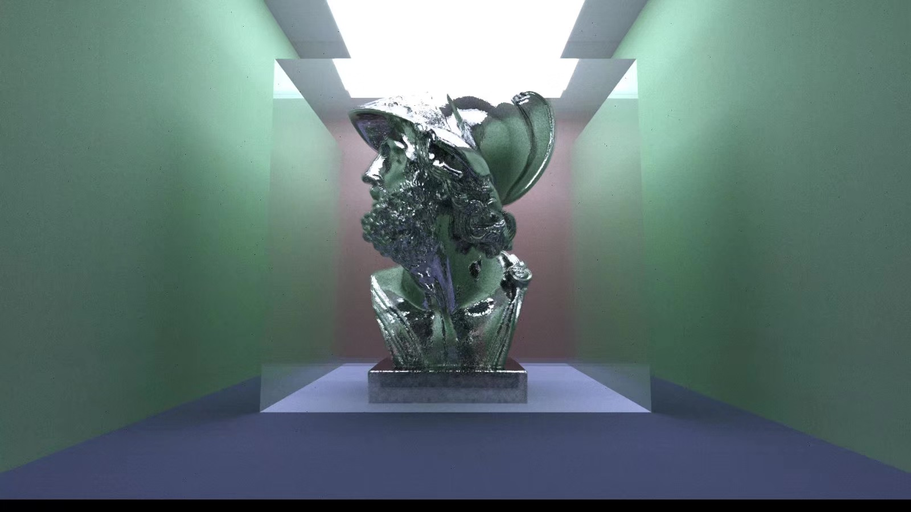
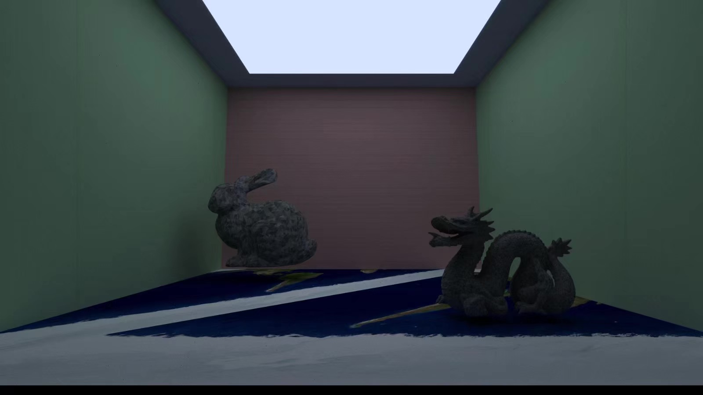
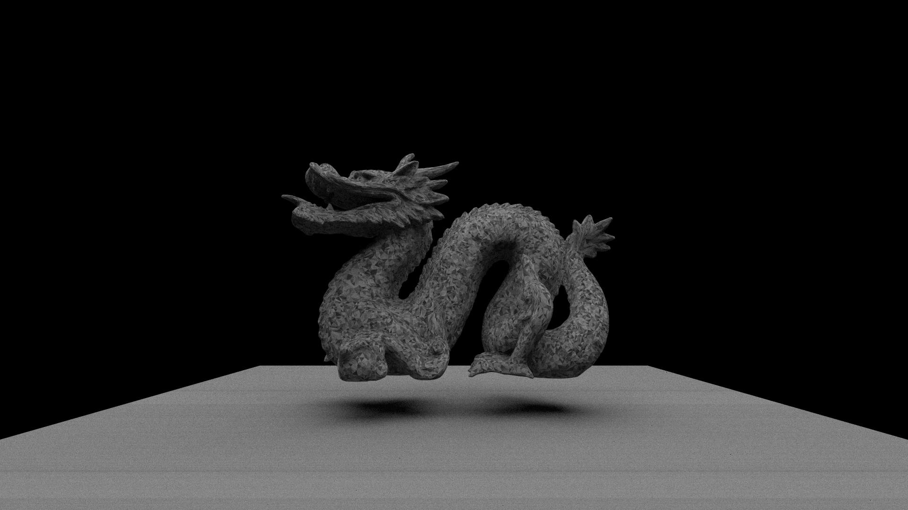

# embree-raytracer
 A simple path tracer written in C++ with intel embree library.
## How to Build & Run
```shell
git clone https://github.com/Makalou/embree-raytracer.git
```
or 
```shell
git clone git@github.com:Makalou/embree-raytracer.git
```
This project is managed by CMake so please make sure that CMake has been installed before following proccess.

At the root path of project:
```shell
mkdir build
```
```shell
cd build
```
```shell
cmake ..
```

## Showcases








